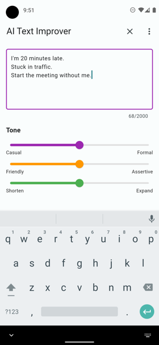
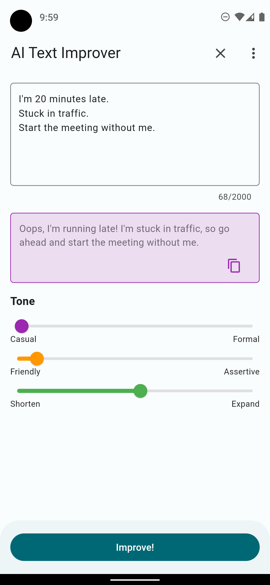
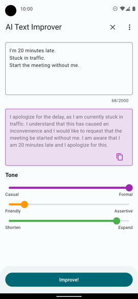

# AI Text Improver

> An AI-based text improvement tool built in Flutter, powered by GPT.





## Description

The _AI Text Improver_ app is a handy Flutter application that allows you to enhance your text messages by providing various tones such as casual, formal, friendly, and more. It leverages the power of GPT (Generative Pre-trained Transformer) as a service to offer you improved versions of your text.

## Getting Started

These instructions will help you get a copy of the project up and running on your local machine for development and testing purposes.

### Prerequisites

- To run the app, you need to have the Flutter SDK installed on your system. [Flutter Installation Guide](https://flutter.dev/docs/get-started/install)

### Installation

1. Clone the repository:

   ```bash
   git clone git@github.com:deengel/ai_text_improver_app.git
   ```

2. Navigate to the project directory:

   ```bash
   cd ai_text_improver_app
   ```

3. Install dependencies:

   ```bash
   flutter pub get
   ```

4. Run the app:

   ```bash
   flutter run
   ```

Upon the first startup, you'll need to provide your own GPT API key. You can obtain a free API key [here](https://beta.openai.com/).

## Usage

- Enter a text message in the input field.
- Select the tone you want to apply to your text.
- Tap the "Improve" button to get the improved text.
- You can copy the improved text to your clipboard or share it with others.

## Contributing

Feel free to contribute to the project by opening issues or submitting pull requests.

## License

This app is licensed under the MIT License. You can view, modify, and use the source code for your own projects. A copy of the license can be found in the [LICENSE](LICENSE) file.